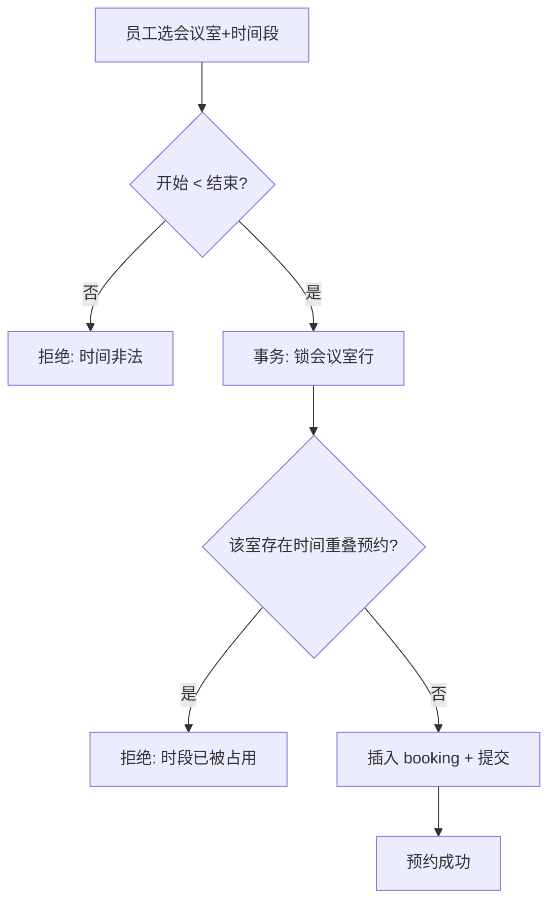
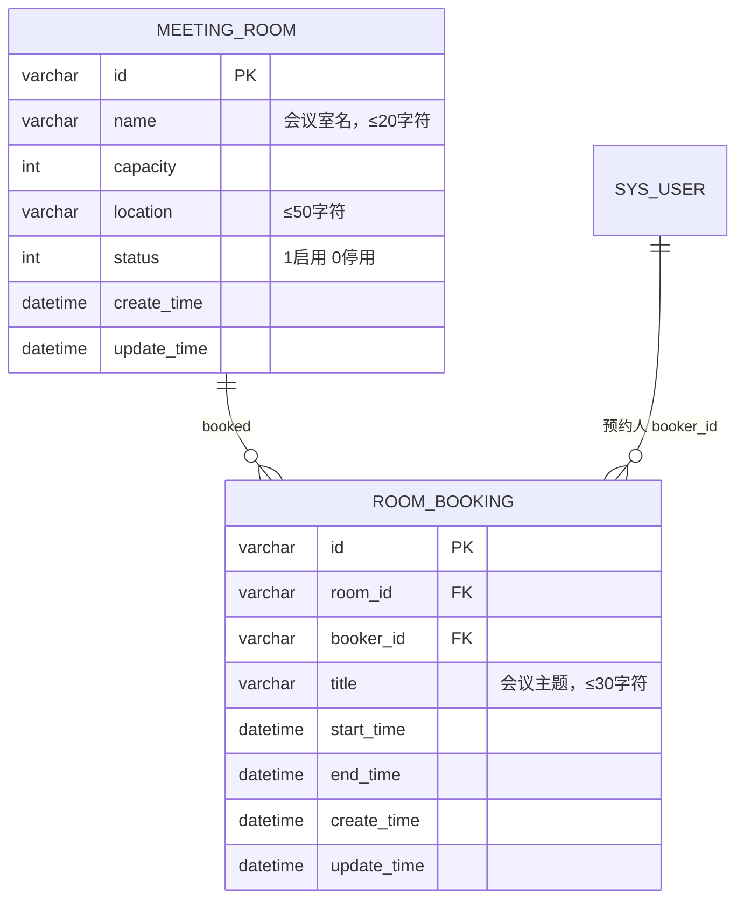

# Design 001 · 会议室预约

## Summary

新增会议室与预约两张表：员工查看启用会议室及占用、预约/取消一个时间段，管理员维护会议室。核心难点是**同会议室时间段重叠的并发防重订**——靠事务内行锁 + 重叠校验，不只靠唯一键。覆盖 PRD 001 的 R1–R8。

## Problem Frame

会议室靠口头协调导致撞车。要把「查空闲 → 预约 → 防撞车」做成自助。撞车判定是**时间段重叠**（非相等），普通唯一键覆盖不了，是本设计的关键决策点。

## 概要设计

### 架构与模块
- **后端**：`meeting` 模块——`MeetingRoom`、`RoomBooking` 的 entity/mapper/service；`RoomController`（会议室维护，`admin`）、`BookingController`（预约，`staff`）。
- **前端**：员工端「会议室预约」页（列表 + 占用 + 预约/取消）；管理端「会议室管理」页（增/改/停用）。
- **外部依赖**：现有用户/角色体系（`staff` / `admin`）。

### 核心业务流程



### 技术选型与关键决策
- **重叠判定不能用唯一键**：时间段重叠是范围条件（`start < 已有.end AND end > 已有.start`），唯一键只能挡「完全相等」。→ 用**事务 + 会议室行锁**串行化同一会议室的并发预约（详见详细设计）。
- **停用是软状态**：`meeting_room.status`（1 启用 / 0 停用），停用只挡新预约，不动历史。
- **预约人取登录态**：`booker_id` 服务端从主体取，不信前端。

### 接口清单与契约

| 方法 | path | 鉴权 | 入参 | 出参 | 校验 / 新增错误码 | 覆盖 |
| --- | --- | --- | --- | --- | --- | --- |
| GET | `/api/room/list` | staff | `{ date? }` | 启用会议室 + 当日占用段 | —— | R1 |
| POST | `/api/room/save` | admin | room 字段 | success | `name ≤ 20 字符`、容量>0 / `ERR_NAME_TOO_LONG` | R5 |
| POST | `/api/room/disable` | admin | `{ roomId }` | success | —— | R7 |
| POST | `/api/booking/book` | staff | `{ roomId, title, startTime, endTime }` | success | `start<end`、室启用、无重叠、`title ≤ 30` / `ERR_TIME_INVALID`、`ERR_OVERLAP`、`ERR_ROOM_DISABLED` | R2、R3 |
| POST | `/api/booking/cancel` | staff | `{ bookingId }` | success | 仅本人、未开始 / `ERR_NOT_OWNER`、`ERR_STARTED` | R4 |
| POST | `/api/booking/admin-cancel` | admin | `{ bookingId }` | success | —— | R8 |

典型请求/返回示例：
```http
POST /api/booking/book   { "roomId":"R301", "title":"周会", "startTime":"2026-06-10 14:00", "endTime":"2026-06-10 15:00" }
200 { "code": 0, "msg": "预约成功" }
409 { "code": "ERR_OVERLAP", "msg": "该时段已被占用" }
```

### 前端设计
- **页面清单 + 路由**
  - `views/booking/index`（路由 `/booking`，`staff`）——会议室列表 + 选中后看当日占用 + 预约/取消。
  - `views/room/index`（路由 `/admin/room`，`admin`）——会议室增/改/停用表格。
- **页面间关系**：员工页选会议室 →（同页）右侧加载该室当日占用 → 预约/取消就地刷新；管理页表格行内编辑/停用，就地刷新。
- **每页接口**：`/booking` → `room/list`、`booking/book`、`booking/cancel`；`/admin/room` → `room/save`、`room/disable`。

### 权限设计（四级）
- **菜单**：「会议室预约」对 `staff` 可见；「会议室管理」对 `admin` 可见。
- **按钮**：管理页增/改/停用按钮 `v-permission="['admin']"`。
- **接口**：见上表 `@RequiresRoles`。
- **数据（行级）**：取消接口的预约归属服务端校验 `booking.booker_id == 当前用户`（管理员走 `admin-cancel` 绕过归属）。

| 操作 | staff | admin |
| --- | --- | --- |
| 查看/预约/取消本人 | ✓ | ✓ |
| 维护会议室 / 取消任意预约 | ✗ | ✓ |

### 非功能约束承接
- **并发**：同室重叠预约竞态 → 行锁 + 重叠校验（详细设计）。
- **安全**：预约人取登录态；取消校验归属。
- **性能**：占用查询按 `room_id + 日期` 走索引。

### 可观测与审计设计
- **关键日志**：预约/取消打印 `roomId、booker_id、时间段、结果`；重叠拒绝打印冲突的已有预约 id。
- **审计**：管理员取消他人预约（R8）记录 `操作人、bookingId、时间`（正式审计表留待后续）。

### 风险与回滚
- **双订**：头号风险，靠行锁 + 重叠校验兜底（见详细设计）。
- **回滚**：两张新表可整体 DROP，存量不受影响（见 migration 回滚段）。

## 数据 ER 模型


> **时间戳规约**：两张业务表均带 `create_time` + `update_time`。
> **字段长度规约**（utf8mb4，varchar(N)=N 字符，按最大汉字数定义，DB 字符数为唯一真值）：

| 字段 | 类型 | 最大字符数 | 内容类型 |
| --- | --- | --- | --- |
| meeting_room.name | varchar | 20 | 汉字/字母/数字 |
| meeting_room.location | varchar | 50 | 汉字/字母/数字 |
| room_booking.title | varchar | 30 | 汉字/字母/数字 |

> 物理建表与回滚见 `examples/ops/install/migration-2026-meeting-room-booking.sql`，与本 ER 逐字段一致。

---

> **检查点**：以上**概要设计 + ER 已锁定**。下面详细设计只展开 ER/概要推不出、且推错代价高的决策（并发防重订）。其余（会议室 CRUD、列表查询、表单校验）能从概要 + 约定可靠生成，**不在此预写**，留给 `ce-work`。

## 详细设计

### 并发防重订（覆盖 R3）
- **依赖**：概要§接口 `booking/book`、ER §`ROOM_BOOKING`。
- **问题**：重叠是范围条件，唯一键挡不住；两请求并发各自「查无重叠 → 插入」会双订。
- **设计**（`@Transactional`）：
  1. `SELECT * FROM meeting_room WHERE id=? AND status=1 FOR UPDATE`——对会议室行加锁，把同一会议室的并发预约**串行化**（停用的查不到即拒 `ERR_ROOM_DISABLED`）。
  2. 持锁后查重叠：`SELECT 1 FROM room_booking WHERE room_id=? AND start_time < :end AND end_time > :start LIMIT 1`；命中即抛 `ERR_OVERLAP` 回滚。
  3. 无重叠 → `INSERT booking`（`booker_id`=登录态、`create_time`=now）→ 提交释放锁。
- **为什么这样**：行锁保证「查重叠 → 插入」对同一会议室原子且串行；不同会议室互不阻塞（锁粒度=会议室）。重叠 SQL 的 `start<end AND end>start` 是标准区间相交判定。

### 取消与归属（覆盖 R4、R8）
- **依赖**：概要§权限设计（行级）。
- **设计**：员工 `cancel` 校验 `booking.booker_id==当前用户` 且 `now < start_time`，否则 `ERR_NOT_OWNER`/`ERR_STARTED`；管理员 `admin-cancel` 不校验归属、不受开始前限制。取消即 `DELETE booking` 释放时段。
