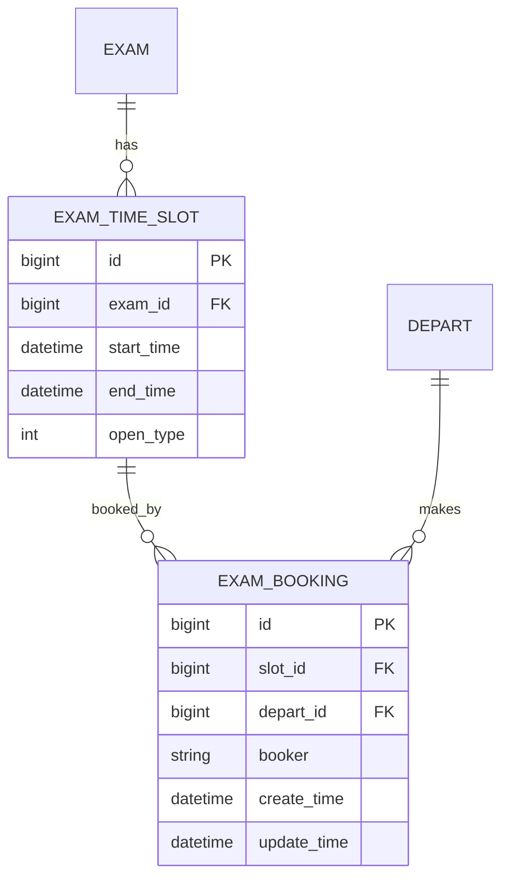

# <NNN> <特性名> · Design

## Summary
〔一段话：整体技术方案是什么〕

## Problem Frame
〔要解决的问题与约束，承接 PRD 的目标/非目标〕

## 概要设计
- **架构与模块**：〔后端模块 / 前端页面 / 外部依赖，及它们的协作关系〕
- **技术选型与关键决策**：〔选了什么、为什么、放弃的备选（可追溯）〕
- **接口清单与契约**：〔path / 方法 / 入参出参 + 鉴权（如 @RequiresRoles）、字段校验、分页约定、新增错误码（按域续编），对应覆盖的 R/F〕

  | 方法 | path | 鉴权 | 入参 | 出参 | 新增错误码 | 覆盖 |
  | --- | --- | --- | --- | --- | --- | --- |
  | POST | /xxx | sa | {…} | {…} | ERR_XXX「…」 | R8 |

- **前端设计**（涉及界面时）：
  - 页面清单 + 路由：〔page → route〕
  - 页面间关系：〔A 页 →（带 id）→ B 页；列表→详情→编辑 等跳转/数据流〕
  - 关键组件 + 每页调用的接口：〔组件划分；某页调哪几个接口〕
  - UI 以 `docs/engineering/prototype/<page>.html` 为基线，本节只讲结构与协作
- **权限与可见域**：
  - 权限矩阵：〔角色 × 接口/操作，谁能调〕

    | 接口/操作 | sa | teacher | assistant | student |
    | --- | --- | --- | --- | --- |
    | /xxx | ✓ | ✗ | ✗ | ✗ |

  - 行级可见域：〔按部门/角色过滤数据，如 assistant 只看本部门〕
- **非功能约束承接**：〔PRD 的每条 NFR → 对应的设计手段或校验点〕
- **风险与回滚**：〔高风险点、并发/权限/性能注意项〕

## 数据 ER 模型

> ER 是逻辑视图，是 `/spec-plan` 物理 migration（建表脚本）的唯一逻辑来源，二者逐字段一致。
>
> **时间戳规约**：业务实体默认带创建/更新时间戳两列（命名沿用项目惯例，如 `create_time`/`update_time`）；纯字典/只读/中间表可豁免，但要注明原因（如 `EXAM_SLOT_DEPART：纯关联表，无需时间戳`）。

## 详细设计
〔按模块 / 接口 / 关键流程组织，不按实现单元——拆单元在 /spec-plan，那里反向引用本节〕

### <模块/接口名>（覆盖 R8、R9）
- **接口签名**：〔入参出参类型、错误码/异常约定〕
- **核心逻辑**：〔关键算法 / 判定规则 / 状态机〕
- **并发与幂等**（占名额、重复提交等高频写场景才写）：〔乐观锁 / 悲观锁 / 唯一键兜底 / 接口幂等键，及冲突时的失败处理与提示〕
- **必要时序**：〔复杂交互的调用顺序与边界条件，如资格判定、并发占名额、回滚补偿〕

### <模块/接口名>（覆盖 R10）
…
