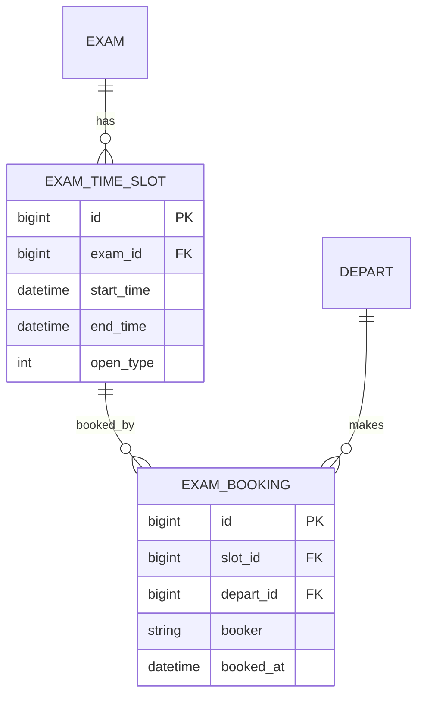

# 计划阶段：PRD + 原型 → 含设计的实现计划

**当前年份 2026**。

流水线**第 3 阶段（计划）**，回答 **HOW**：先做**技术设计**（概要设计 + 数据 ER 模型 + 详细设计），再拆成可执行任务、依赖顺序、迁移脚本、风险。上游是 `/spec-prd`（+ `/spec-prototype`），下游是开发与后续 workflow 阶段。

> **设计就放在计划里**（不另起独立设计文档）：概要设计与 ER 是制定计划的前提，详细设计写进每个实现单元。保持单一事实源，改一处即全链生效。需求层面的改动回流 `/spec-change`，不在 plan 里临时发明需求。

## 术语提示

PRD 的功能需求用 **R/F** 编号、验收用 **AE/AC** 编号（详见 `/spec-prd` 术语表）。计划要把它们接成可追溯链：**`R/F`（要做什么）→ 设计/任务（怎么做）→ `AE/AC`（怎么算做对了）**。

## 核心原则

1. **单一事实源** — 项目的 `docs/engineering/workflow.md` 阶段 3「完成标准」是最高约束；本 skill 内置默认值，项目文档存在时以其为准。
2. **同序号串联** — plan 复用与 PRD **完全相同**的 `YYYY-MM-DD-NNN`，`prd/…-NNN-*` ↔ `plans/…-NNN-*` 一眼对应。
3. **设计先于拆分** — 先定架构与数据模型（概要 + ER），任务才拆得准；详细设计落到每个单元。
4. **任务可独立认领** — 每个单元标注 Files / Dependencies / Patterns to follow / 接口签名 / 核心逻辑，并映射它实现的 `R/F` 和验证它的 `AE/AC`。
5. **数据设计逻辑+物理对照** — ER 模型（逻辑）与 migration sql（物理）放一起、保持一致。

## 执行流程

### Phase 0 · 加载输入

1. 读 `docs/engineering/workflow.md` 阶段 3 与「命名与追溯约定」。
2. 读目标 PRD（`$ARGUMENTS` 指定，或 `docs/product/prd/` 最近 `status: active` 的一份），取其 `NNN` 与全部 `R/F`、`AE/AC`。
3. 读对应原型页面（`docs/engineering/prototype/`），作为前端任务的 UI 参考。
4. 扫相关代码与现有数据库脚本（`docs/ops/install/`），识别要改的表/接口/页面与既有模式（Patterns to follow）。

### Phase 1 · 概要设计

确定整体技术方案，写清：
- **架构与模块划分**：本特性涉及的后端模块/前端页面/外部依赖，以及它们的协作关系。
- **技术选型与关键决策**：选了什么、为什么、放弃了什么备选（决策要可追溯）。
- **接口清单**：新增/变更的接口（path、方法、入参出参概述），与覆盖的 `R/F` 对应。
- **风险与回滚**：高风险点、并发/权限/性能注意项。

### Phase 2 · 数据 ER 模型

把数据设计画成 **Mermaid `erDiagram`**（逻辑视图），实体、关系、关键字段、主外键、唯一约束都体现出来：

ER 是**逻辑视图**，与 Phase 3 的 migration sql（**物理脚本**）一一对应、保持一致。

### Phase 3 · DB 变更与迁移

涉及数据库的改动落到 `docs/ops/install/migration-YYYY-<特性名>.sql`：建表/加字段/索引/唯一键/种子数据，写清安全性与可回滚方式，并在相关任务里引用该脚本。确保与 Phase 2 的 ER 模型逐字段一致。

### Phase 4 · 拆任务 + 详细设计 + 追溯

把方案拆成可独立认领的实现单元（U1/U2…），每个单元同时承载**详细设计**：
- **Files**：要新增/修改的文件（repo-relative 路径）。
- **Dependencies**：依赖哪个单元先完成。
- **Patterns to follow**：参照现有哪段代码的写法/分层。
- **详细设计**：关键接口签名、核心算法/判定逻辑、必要时序（资格判定、并发占名额等复杂点要写清）。
- **覆盖需求**：实现哪些 `R/F`。
- **Test scenarios**：对应哪些 `AE/AC`，怎么验。

并说明与其他 plan 的并行/冲突关系。

### Phase 5 · 写计划文件

写到 `docs/engineering/plans/YYYY-MM-DD-NNN-<type>-<slug>-plan.md`（`<type>` 常用 `feat/fix/refactor`），结构：
- **frontmatter**：`title` / `type` / `status: active` / `date` / `origin`（指向 PRD 或 brainstorm）。
- 正文：Summary → Problem Frame → **概要设计**（Phase 1）→ **数据 ER 模型**（Phase 2 的 mermaid）→ **DB 迁移**（引用 migration sql）→ Requirements 映射 → **Implementation Units**（含详细设计的 Phase 4 单元）。

### Phase 6 · 交接（进入 workflow 后续阶段）

输出计划路径、任务清单与依赖顺序。然后提示按 `docs/engineering/workflow.md` 继续：

- **阶段 4 开发** → `/ce-work` 驱动，先开特性分支；并行/复杂特性用 `/ce-worktree`。改动需求范围时**先回流 `/spec-change`**。
- **阶段 5 评审** → `/code-review`（可 `--fix`/`--comment`）；深度用 `/ce-code-review`；纯质量清理 `/simplify`。
- **阶段 6 测试** → 拿 PRD 的 `AE/AC` 逐条验；`/verify` 跑应用；前端 `/ce-test-browser`。
- **阶段 7 合并** → `/ce-commit-push-pr`；合并后把本 plan 的 `status` 更新为 `done`。
