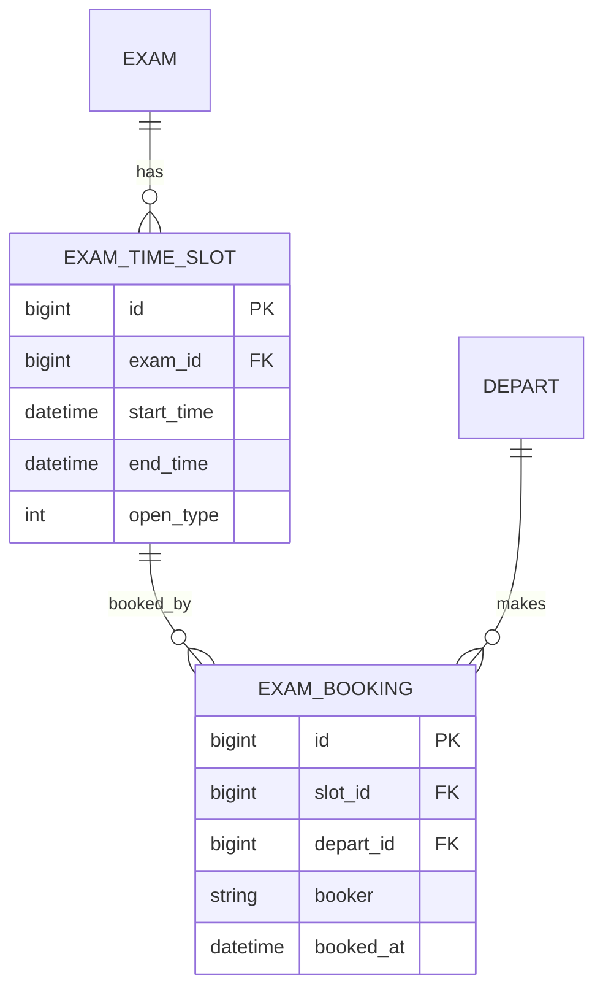

# <NNN> <特性名> · Plan

## Summary
〔一段话：做什么、整体方案〕

## Problem Frame
〔要解决的问题与约束，承接 PRD 的目标/非目标〕

## 概要设计
- **架构与模块**：〔后端模块 / 前端页面 / 外部依赖，及它们的协作关系〕
- **技术选型与关键决策**：〔选了什么、为什么、放弃的备选（可追溯）〕
- **接口清单**：〔path / 方法 / 入参出参概述，对应覆盖的 R/F〕
- **非功能约束承接**：〔PRD 的每条 NFR → 对应的设计手段或校验点〕
- **风险与回滚**：〔高风险点、并发/权限/性能注意项〕

## 数据 ER 模型

> ER 是逻辑视图，与下面 DB 迁移（物理脚本）逐字段一致。

## DB 迁移
〔引用 `docs/ops/install/migration-<YYYY>-<特性名>.sql`；建表/加字段/索引/唯一键/种子数据 + 安全性与回滚方式。骨架见本目录 `migration.sql`〕

## Requirements 映射 + 覆盖矩阵
| 需求 | 实现单元 | 验收 |
| --- | --- | --- |
| R8 | U2、U3 | AE2、AE5 |

> 规则：每条 R/F 至少落到一个 U、且至少被一条 AE/AC 验证；任何一格为空都要回头补，或把该需求降级为非目标。

## Implementation Units

### U1 <单元名>
- **Files**：〔要新增/修改的文件，repo-relative 路径〕
- **Dependencies**：〔依赖哪个单元先完成〕
- **Patterns to follow**：〔参照现有哪段代码的写法/分层〕
- **原型页面**（前端/界面任务必填）：〔docs/engineering/prototype/<page>.html，UI 以原型为准；偏离先走 /spec-change 改原型〕
- **Execution note**（前端/界面任务必填）：用 `/ce-frontend-design` 方法论实现，收尾前按其要求截图自检设计保真度〔纯后端/逻辑单元留空或写执行姿态，如 test-first / characterization-first〕
- **详细设计**：〔关键接口签名、核心算法/判定逻辑、必要时序（资格判定、并发占名额等复杂点写清）〕
- **覆盖需求**：〔实现哪些 R/F〕
- **Test scenarios**：〔对应哪些 AE/AC，怎么验〕

### U2 <单元名>
…
